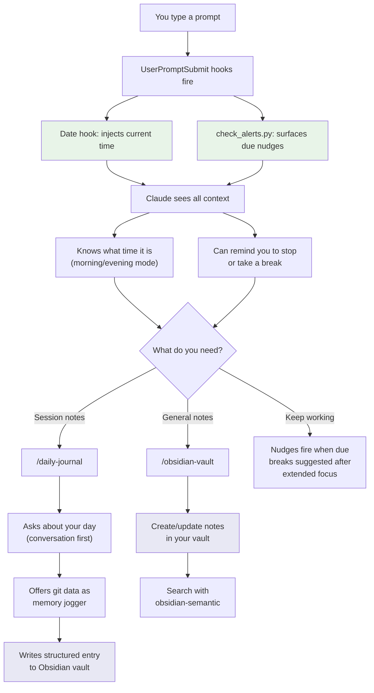

# claude-adhd-skills

This is a set of Claude Code skills and hooks that I use every day as a framework for developing with agents, and managing my ADHD. The workflows are still evolving, but central to is Obsidian integration, time awareness for Claude (date command in post hook), and task reminders. Naturally, these can be used by anybody (ADHD not required).

## What's in here

### Skills

| Skill | What it does |
|-------|-------------|
| **daily-journal** | Conversational daily journaling -- asks you about your day instead of generating reports from commit logs. Writes to Obsidian. |
| **obsidian-vault** | Vault-aware note management -- folder hierarchy, naming conventions, frontmatter, internal linking. |
| **nudge** | Time-based reminders that fire on prompt submission. "Stop me at 11" or "remind me about standup in 30m". |
| **test-driven-development** | Logic Gate + Iron Rule (based on obra's TDD skill): triage what needs tests, then strict test-first for anything with logic. |

### Hooks

| Hook | What it does |
|------|-------------|
| **date hook** | Injects current date and time into every prompt so Claude knows when it is. Enables time-aware journaling (morning/evening modes) |
| **check_alerts.py** | Checks for due nudges on every prompt submission. |
| **add_alert.py** | Adds a new timed nudge (`+30m`, `23:00`, etc.). |
| **ack_alert.py** | Dismisses a fired nudge. |

### CLAUDE.md.example

A starting point for your own `CLAUDE.md` with ADHD-specific patterns: break suggestions, pacing, focus tracking, and a working relationship that prioritizes asking over assuming.

## Installation

### 1. Copy skills to your Claude Code config

```bash
# Clone the repo
git clone https://github.com/ravila4/claude-adhd-skills.git
cd claude-adhd-skills

# Copy skills into your Claude Code skills directory
cp -r skills/* ~/.claude/skills/

# Copy hooks
cp hooks/* ~/.claude/hooks/
```

### 2. Wire up the hooks

Copy the hook configuration into your Claude Code settings. The settings file is at `~/.claude/settings.json` (global) or `~/.claude/settings.local.json` (local/private).

See `settings.json.example` for the full config. The key hooks are:

- **UserPromptSubmit**: Runs on every prompt. Shows current time and any due nudges.

```json
{
  "hooks": {
    "UserPromptSubmit": [
      {
        "type": "command",
        "command": "echo \"Today is $(date '+%A, %B %d, %Y'). Time: $(date '+%H:%M')\"",
        "timeout": 5000
      },
      {
        "type": "command",
        "command": "python3 ~/.claude/hooks/check_alerts.py",
        "timeout": 5000
      }
    ]
  }
}
```

### 3. Set up your CLAUDE.md

Copy `CLAUDE.md.example` to `~/.claude/CLAUDE.md` and fill in the `{PLACEHOLDERS}`:

```bash
cp CLAUDE.md.example ~/.claude/CLAUDE.md
```

Edit the file and replace:
- `{YOUR_NAME}` -- your name
- `{YOUR_ROLE}` -- your job title or role
- `{WHAT_YOU_DO}` -- brief description of your work
- `{YOUR_PLATFORM}` -- your machine/OS (e.g., "MacBook Pro, macOS")
- `{YOUR_WORK_DOMAIN}` -- your work domain (e.g., "web development", "data engineering")

### 4. Customize the Obsidian vault skill

The obsidian-vault skill needs to know your vault path. Edit `~/.claude/skills/obsidian-vault/SKILL.md` and add your vault path to the description:

```yaml
# Before:
description: Manage Obsidian vault operations. Handles markdown formatting...
# After:
description: Manage Obsidian vault operations for my vault at ~/path/to/your/vault. Handles markdown formatting...
```

Then customize `references/vault_structure.md` to match your actual folder hierarchy. The default is minimal (Programming, Projects, Daily Log, Templates) -- add your own topic folders.

### 5. Customize tags

Both the obsidian-vault and daily-journal skills use tags. Look for `<!-- Add your own ... -->` comments in the reference files and add tags relevant to your work.

## How the pieces fit together



## The ADHD philosophy

These tools are designed around a few principles that work for my ADHD brain:

**Passive over active.** The nudge system surfaces information *to you* -- you don't have to remember to check anything. It fires on every prompt submission, which means it works as long as you're working.

**Conversation over reports.** The daily journal asks you what mattered, not what your git log says. Commits are often mechanical. What you *focused on* and *how it felt* is what future-you needs to know.

**Low ceremony.** Setting a reminder is one command. Writing a journal entry is a conversation. Nothing requires opening a separate app or filling out a form.

**Break suggestions built in.** The CLAUDE.md instructs Claude to suggest breaks after extended focus sessions and after completing significant work. The nudge system lets you set hard stops ("stop me at 11 PM").

## Customization

### Adding domain-specific knowledge

The `CLAUDE.md.example` has a "Technical Knowledge" section. Add your own domain expertise here -- books, frameworks, tools. This shapes how Claude approaches problems with you.

### Extending the vault structure

Add folders to `vault_structure.md` for your own knowledge domains. The skill uses this as a decision tree for where to place notes.

### Custom tags

Tags live in `vault_structure.md` and `markdown_formatting.md`. Add your domain-specific tags to the taxonomy.

### Auto Memory

The CLAUDE.md includes an auto-memory system where Claude maintains a `MEMORY.md` file per project. This captures patterns, conventions, and lessons learned across sessions. It's a scratch pad that eventually graduates into proper skills.

## Requirements

- [Claude Code](https://docs.anthropic.com/en/docs/claude-code) CLI
- Python 3.10+
- [Obsidian](https://obsidian.md/) (for the vault and journal skills)
- SQLite3 (usually pre-installed)
- [obsidian-semantic](https://github.com/ravila4/obsidian-semantic) (optional, for semantic search in the obsidian-vault skill)

## License

MIT
